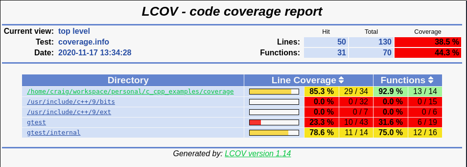
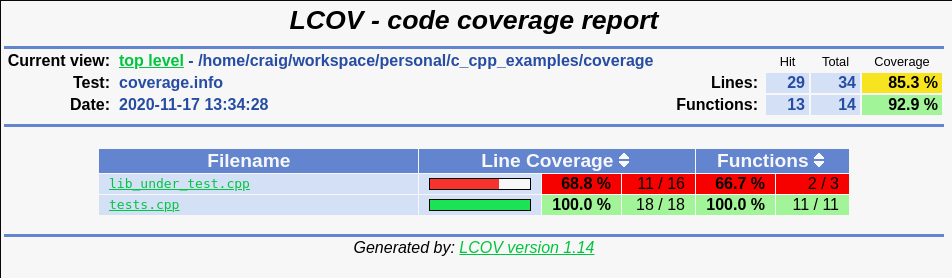
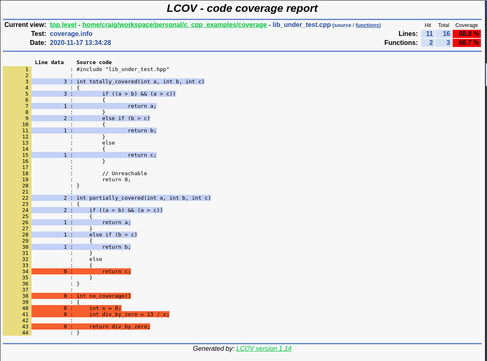

# Generating Test Coverage Reports Using CMake

## Dependencies
Uses [bilke's CodeCoverage.cmake](https://github.com/bilke/cmake-modules/blob/master/CodeCoverage.cmake)

Obtains gtest via FetchContent

```bash
apt install gcc cmake gcov lcov
```

## Generating & viewing coverage reports
```bash
mkdir build && cd build
cmake ..
make coverage
xdg-open coverage/index.html
```

## Sample Output

### Homepage with coarse metrics (including coverage for linked libraries)


### Project files with coarse metrics


### File with fine metrics. "Line data" displays hit count for each line

